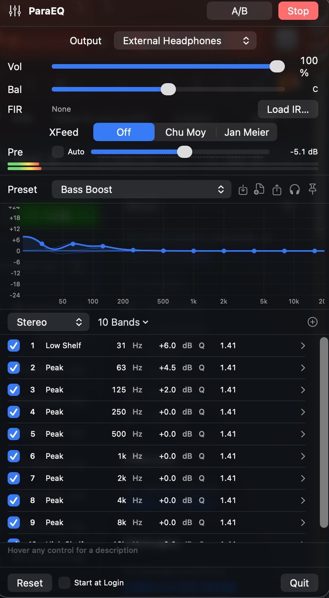

# ParaEQ

A system-wide parametric equalizer for macOS, living in your menu bar. Captures system audio through Apple's Core Audio process-tap API (macOS 14.4+), processes it with a native vDSP filter engine, and plays it out to your headphones or speakers — no virtual audio driver, no kernel extensions, no default-device hijacking.

[](https://github.com/wabsto1/ParaEQ/actions/workflows/ci.yml)

Built with SwiftUI and pure CoreAudio/Accelerate — no external dependencies.

<p align="center">
  
</p>

## Features

**EQ engine**
- Parametric EQ with **5 / 10 / 15 / 31-band layouts**, plus add/remove-band freedom
- **15 filter types**: Peak, Low/High Shelf, Low/High Pass (variable Q), Band Pass, Notch, and Butterworth 6/24 dB-oct + Linkwitz-Riley 12/24 dB-oct crossovers (expanded into biquad cascades)
- **Per-channel EQ**: stereo-linked, independent Left/Right, or **Mid/Side** processing
- **GraphicEQ mode**: variable-node curves rendered as 16384-tap minimum-phase FIR filters (cepstral method, near-zero latency)
- **Convolution**: load impulse-response files (wav/aiff/…, auto-resampled) through a partitioned FFT convolver
- **Headphone crossfeed** (Chu Moy / Jan Meier style)
- **Stereo balance**, master volume, auto- or manual **preamp** (anti-clipping)
- **Lookahead limiter** (5 ms lookahead, instant attack, smooth release) instead of a clipper

**Interface**
- Live frequency-response graph computed from the *exact* coefficients the audio path runs — **drag band dots** to edit frequency/gain directly
- **A/B bypass** button for instant EQ on/off comparison
- Stereo peak meter; per-band expandable controls
- Global **preset hotkeys ⌘⌃1–9**

**Presets & interop**
- Built-in and custom presets; **pin a preset to an output device** and it applies automatically when audio routes there
- **AutoEQ database browser** — search thousands of headphone correction profiles and apply them in one click
- **Import** Equalizer APO / AutoEQ files (`Preamp:`, `Filter N:`, `GraphicEQ:` lines, Q or BW Oct)
- **Export** your curve as Equalizer APO `ParametricEQ.txt` (round-trip compatible)

**System behavior**
- Zero-install capture: one "System Audio Recording" permission prompt, nothing else
- Follows the system default output (or a selected device); survives device hot-plug and default-device changes
- Auto-resumes processing on launch; optional Start-at-Login
- Crash-safe: the system default device is never touched, and settings save within ~1 s of every change
- Diagnostics log at `~/Library/Logs/ParaEQ.log`

## Requirements

- macOS 14.4 (Sonoma) or later — the Core Audio process-tap API is required
- No drivers or additional software

## Installation

```bash
git clone https://github.com/wabsto1/ParaEQ.git
cd ParaEQ
bash build.sh
cp -R .build/ParaEQ.app /Applications/
open /Applications/ParaEQ.app
```

Click **Start** in the menu-bar popover and grant the System Audio Recording permission when prompted (System Settings → Privacy & Security → Screen & System Audio Recording). See the **[User Guide](docs/USER-GUIDE.md)** for a full walkthrough of every feature.

> Rebuild tip: `build.sh` prefers a codesigning identity named "ParaEQ Dev Signing" if present in your keychain, so the TCC permission survives rebuilds. With plain ad-hoc signing, macOS re-prompts after every rebuild.

## Architecture

```
System audio → global process tap (.mutedWhenTapped, own PID excluded)
             → private aggregate device (real output device + tap)
             → single IOProc:
                 [Mid/Side encode] → vDSP biquad cascades (per-channel coefficients)
                 → [minimum-phase FIR / convolution] → [crossfeed]
                 → balance + volume → lookahead limiter → output buffers
```

Filter math is RBJ Audio-EQ-Cookbook biquads run through `vDSP_biquadm` with per-sample coefficient ramping (glitch-free live edits). The response graph evaluates the same coefficients at the engine's actual sample rate.

## Testing

```bash
swift test   # 37 DSP/parser tests: coefficients, slopes, limiter, FIR design, convolver, round-trips
```

**[User Guide](docs/USER-GUIDE.md)** (installation, permissions, every feature) · [docs/ARCHITECTURE.md](docs/ARCHITECTURE.md) · [CHANGELOG.md](CHANGELOG.md) · [CONTRIBUTING.md](CONTRIBUTING.md)

## License

MIT
